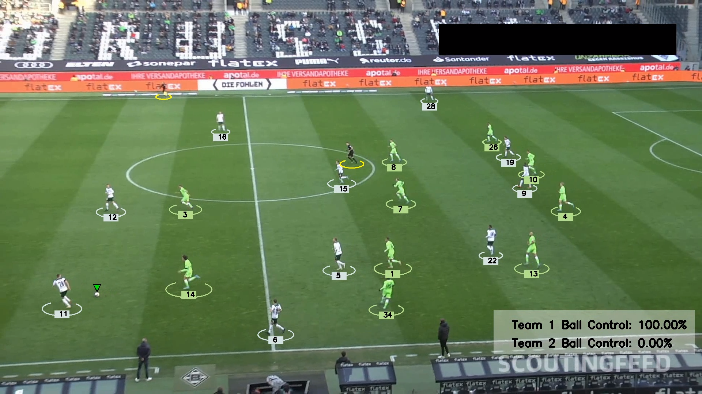

# Football Analysis

A computer vision pipeline that detects players in a football match video, assigns them to teams by jersey colour, tracks ball possession per frame, and produces an annotated output video.

<div align="center">

</div>

---

## Pipeline

```
Input Video (mp4)
       │
       ▼
┌─────────────────────────────────────────────┐
│  1. DETECT & TRACK          tracker.py       │
│                                              │
│  YOLOv5 (models/best.pt)                    │
│  detects 3 classes per frame:               │
│    • player  • referee  • ball              │
│                                              │
│  ByteTrack assigns a stable track_id        │
│  to each detected object across frames.     │
│                                              │
│  Goalkeepers are reclassified as players.   │
│  Ball always gets track_id = 1.             │
│                                              │
│  Results cached to stubs/track_stubs.pkl    │
│  to avoid re-running inference.             │
└───────────────────┬─────────────────────────┘
                    │  tracks dict
                    │  { "players": [...],
                    │    "referees": [...],
                    │    "ball": [...] }
                    ▼
┌─────────────────────────────────────────────┐
│  2. INTERPOLATE BALL        tracker.py       │
│                                              │
│  Ball is often missing for a few frames     │
│  (occlusion, motion blur). Fills gaps       │
│  using linear interpolation + back-fill.    │
└───────────────────┬─────────────────────────┘
                    │
                    ▼
┌─────────────────────────────────────────────┐
│  3. ASSIGN TEAMS            team_assigner.py │
│                                              │
│  For each player bounding box:              │
│    a) Crop the top half (jersey area)       │
│    b) K-Means (k=2) on pixel colours        │
│       → background vs jersey cluster        │
│    c) Extract jersey colour                 │
│                                             │
│  Then K-Means (k=2) across all jersey      │
│  colours → Team 1 and Team 2.              │
│                                             │
│  Each player's team is cached after the    │
│  first prediction (player_team_dict).      │
└───────────────────┬─────────────────────────┘
                    │  team + team_color
                    │  added to each player
                    ▼
┌─────────────────────────────────────────────┐
│  4. ASSIGN BALL POSSESSION  player_ball_     │
│                             assigner.py      │
│                                              │
│  Per frame: find the player whose foot      │
│  bbox corner is closest to the ball.        │
│  Threshold: 70 pixels.                      │
│                                              │
│  If no player is within range, carry        │
│  forward the last known possessor's team.   │
└───────────────────┬─────────────────────────┘
                    │  has_ball flag +
                    │  team_ball_control array
                    ▼
┌─────────────────────────────────────────────┐
│  5. ANNOTATE & SAVE         tracker.py       │
│                                              │
│  For each frame, draws:                     │
│    • Ellipse under each player              │
│      (colour = team colour)                 │
│    • Track ID label on the ellipse          │
│    • Triangle above ball holder             │
│    • Triangle on the ball                   │
│    • Semi-transparent overlay with          │
│      cumulative possession % per team       │
└───────────────────┬─────────────────────────┘
                    │
                    ▼
       Output Video (output_videos/output_video.avi)
```

---

## Project Structure

```
Football_Analysis/
│
├── main.py                  # Runs the full pipeline
│
├── tracker.py               # Detection, tracking, interpolation, annotation
├── team_assigner.py         # Jersey colour clustering → team assignment
├── player_ball_assigner.py  # Ball possession per frame
├── utils.py                 # Video I/O and bbox geometry helpers
│
├── models/                  # Place best.pt here (YOLOv5 weights)
├── input_videos/            # Source video(s)
├── output_videos/           # Annotated output video
├── stubs/                   # Cached track detections (skip re-inference)
│
├── training/                # YOLOv5 training notebook (RoboFlow dataset)
└── development_and_analysis/ # Exploratory notebooks (colour clustering)
```

---

## Running

```bash
python main.py
```

Output is written to `output_videos/output_video.avi`.

To rerun inference from scratch instead of using the cached stub, set `read_from_stub=False` in `main.py`:

```python
tracks = tracker.get_object_tracks(video_frames, read_from_stub=False, stub_path='stubs/track_stubs.pkl')
```

---

## Dependencies

```
ultralytics   # YOLOv5 inference
supervision   # ByteTrack multi-object tracker
opencv-python # Video I/O and drawing
scikit-learn  # K-Means clustering
pandas        # Ball position interpolation
numpy
```
